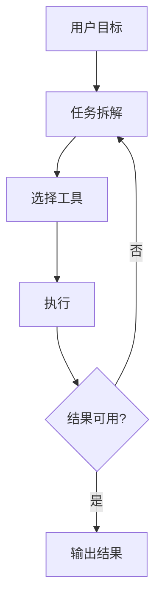

# 拆解 AI Agent：它到底比普通聊天助手多了什么？

> 真正让 Agent 变得有价值的，不是“会回答问题”，而是“会把目标拆成步骤，然后逐步执行”。

## 一、先说结论

如果把聊天助手理解为“给你答案”，那么 Agent 更像“替你推进任务”。

它通常会做 4 件事：

1. 理解目标
2. 拆分步骤
3. 调用工具
4. 检查结果

## 二、一个最小工作流

## 三、它和普通聊天助手的区别

| 能力 | 普通聊天助手 | AI Agent |
| --- | --- | --- |
| 回答问题 | 强 | 强 |
| 多步骤执行 | 弱 | 强 |
| 工具调用 | 偶尔 | 常态 |
| 失败重试 | 少 | 更常见 |

## 四、最适合的场景

- 多步骤信息整理
- 内容研究与写作
- 需要搜索、总结、输出一起完成的任务

## 五、最大的限制

Agent 看起来更聪明，但真正难的是：

- 步骤是否稳定
- 工具结果是否可靠
- 失败后能否回正

## 六、最后判断

Agent 的价值不在“替代所有人”，而在于它能把复杂任务变成一条可观察、可干预、可优化的流程。
